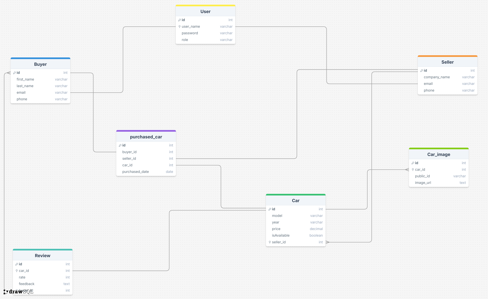

# Car Purchase REST Service

This project develops a RESTful API for managing car purchases, connecting buyers, sellers, and cars. It's built with
Spring Boot and designed to provide basic CRUD operations for all core entities.

---

## Project Overview

The Car Purchase Service facilitates the buying and selling of cars through a set of RESTful endpoints. It aims to
provide a clear and functional API for managing the entire car purchase lifecycle, from listing cars by sellers to
tracking purchases by buyers.

---

## Technologies Used

* **Framework:** Spring Boot
* **Build Tool:** Maven
* **Database:** PostgreSQL
* **API Documentation:** Swagger UI (OpenAPI UI)
* **Testing:** JUnit, Mockito
* **Logging:** SLF4J with Logback
* **Code Quality:** SonarQube, JaCoCo
* **Object Mapping (Optional):** MapStruct or ModelMapper (can be integrated if needed for DTO-DAO conversions)

---
# Car Purchase Service Database Schema

## Core Entities and Their Relationships

### Entities

We've made some meaningful assumptions about the properties for each entity:

* **Buyer**
    * `id` (Long - Primary Key)
    * `firstName` (String)
    * `lastName` (String)
    * `email` (String - Unique)
    * `phoneNumber` (String)

---

* **Seller**
    * `id` (Long - Primary Key)
    * `companyName` (String)
    * `email` (String - Unique)
    * `phoneNumber` (String)

---

* **Car**
    * `id` (Long - Primary Key)
    * `make` (String)
    * `model` (String)
    * `year` (Integer)
    * `price` (Double)
    * `isAvailable` (Boolean - Default: `True`)
    * `sellerId` (Long - Foreign Key to Seller)

---

* **PurchasedCar**
    * `id` (Long - Primary Key)
    * `purchaseDate` (LocalDate)
    * `carId` (Long - Foreign Key to Car - Unique, once purchased, a car cannot be purchased again)
    * `buyerId` (Long - Foreign Key to Buyer)
    * `sellerId` (Long - Foreign Key to Seller)

---

* **Car Image**
    * `id` (Long - Primary Key)
    * `carId` (Long - Foreign Key to Car - Unique, once purchased, a car cannot be purchased again)
        * `ImageName` (String)
        * `ImageUri` (String)

---

* **Review**
    * `id` (Long - Primary Key)
    * `rate` (String)
    * `feedback` (String)
    * `buyerID` (FK - Buyer entity)
    * `CarID` (FK - car entity)

---

* **User**
    * `id` (Long - Primary Key)
    * `userName` (String)
    * `password` (String)
    * `role` (String)

---


### Entity Relationships diagram




This repository contains the SQL schema for a simple car sales platform. It models entities like buyers, sellers, cars, car images, reviews, and user authentication, along with the relationships between them.

---

## Table of Contents

* [Database Overview](#database-overview)
* [Entities and Relationships](#entities-and-relationships)
    * [Buyer](#buyer)
    * [Seller](#seller)
    * [Car](#car)
    * [Car_image](#car_image)
    * [Review](#review)
    * [User](#user)
    * [purchased_car](#purchased_car)
* [Foreign Key Relationships](#foreign-key-relationships)

---

## Database Overview

This schema is designed to support the core functionalities of a car sales application, including:

* **User Management:** Differentiating between buyers and sellers, and handling general user authentication.
* **Car Listings:** Storing details about cars for sale and their associated images.
* **Transactions:** Recording details of purchased cars.
* **Feedback:** Allowing buyers to review cars.

---

## Entities and Relationships

Below is a detailed description of each table (entity) in the database.

### `Buyer`

Represents individual users who purchase cars.

| Column       | Type       | Constraints      | Description                     |
| :----------- | :--------- | :--------------- | :------------------------------ |
| `id`         | `INTEGER`  | `PRIMARY KEY`    | Unique identifier for the buyer |
| `first_name` | `VARCHAR`  | `NOT NULL`       | Buyer's first name              |
| `last_name`  | `VARCHAR`  | `NOT NULL`       | Buyer's last name               |
| `email`      | `VARCHAR`  | `NOT NULL`       | Buyer's email address (unique)  |
| `phone`      | `VARCHAR`  | `NOT NULL`       | Buyer's phone number            |

### `Seller`

Represents companies or individuals selling cars.

| Column         | Type      | Constraints   | Description                          |
| :------------- | :-------- | :------------ | :----------------------------------- |
| `id`           | `INTEGER` | `PRIMARY KEY` | Unique identifier for the seller     |
| `company_name` | `VARCHAR` | `NOT NULL`    | Name of the selling company/individual |
| `email`        | `VARCHAR` | `NOT NULL`    | Seller's email address (unique)      |
| `phone`        | `VARCHAR` | `NOT NULL`    | Seller's phone number                |

### `Car`

Stores details about cars available for sale.

| Column      | Type          | Constraints   | Description                        |
| :---------- | :------------ | :------------ | :--------------------------------- |
| `id`        | `INTEGER`     | `PRIMARY KEY` | Unique identifier for the car      |
| `model`     | `VARCHAR`     | `NOT NULL`    | Car model (e.g., "Civic", "F-150") |
| `year`      | `VARCHAR`     | `NOT NULL`    | Manufacturing year of the car      |
| `price`     | `DECIMAL(8,2)`| `NOT NULL`    | Selling price of the car           |
| `isAvailable`| `BOOLEAN`     | `NOT NULL`    | Indicates if the car is currently available for sale |
| `seller_id` | `INTEGER`     | `NOT NULL`    | `FOREIGN KEY` to `Seller` table    |

### `Car_image`

Stores image URLs and public IDs for each car.

| Column      | Type      | Constraints   | Description                      |
| :---------- | :-------- | :------------ | :------------------------------- |
| `id`        | `INTEGER` | `PRIMARY KEY` | Unique identifier for the image  |
| `car_id`    | `INTEGER` | `NOT NULL`    | `FOREIGN KEY` to `Car` table     |
| `public_id` | `VARCHAR` | `NOT NULL`    | Public ID of the image (e.g., for cloud storage) |
| `image_url` | `TEXT`    | `NOT NULL`    | URL of the car image             |

### `Review`

Stores feedback and ratings provided by buyers for cars.

| Column     | Type      | Constraints   | Description                      |
| :--------- | :-------- | :------------ | :------------------------------- |
| `id`       | `INTEGER` | `PRIMARY KEY` | Unique identifier for the review |
| `car_id`   | `INTEGER` | `NOT NULL`    | `FOREIGN KEY` to `Car` table     |
| `rate`     | `INTEGER` | `NOT NULL`    | Rating for the car (e.g., 1-5)   |
| `feedback` | `TEXT`    | `NOT NULL`    | Detailed feedback text           |
| `buyer_id` | `INTEGER` | `NOT NULL`    | `FOREIGN KEY` to `Buyer` table   |

### `User`

Handles authentication and roles for users (potentially linking to `Buyer` or `Seller` via email).

| Column      | Type      | Constraints   | Description                     |
| :---------- | :-------- | :------------ | :------------------------------ |
| `id`        | `INTEGER` | `PRIMARY KEY` | Unique identifier for the user  |
| `user_name` | `VARCHAR` | `NOT NULL`    | User's login username (e.g., email) |
| `password`  | `VARCHAR` | `NOT NULL`    | Hashed password                 |
| `role`      | `VARCHAR` | `NOT NULL`    | User role (e.g., "Buyer", "Seller", "Admin") |

**Note on `User` foreign keys:** The schema indicates `user_name` can reference both `Seller.email` and `Buyer.email`. This implies that `user_name` likely stores the email address, allowing a single `User` entry to link to either a `Buyer` or `Seller` profile based on their role. This design needs careful handling at the application level to ensure consistency.

### `purchased_car`

Records details of cars that have been bought.

| Column         | Type      | Constraints   | Description                          |
| :------------- | :-------- | :------------ | :----------------------------------- |
| `id`           | `INTEGER` | `PRIMARY KEY` | Unique identifier for the purchase record |
| `buyer_id`     | `INTEGER` | `NOT NULL`    | `FOREIGN KEY` to `Buyer` table       |
| `seller_id`    | `INTEGER` | `NOT NULL`    | `FOREIGN KEY` to `Seller` table      |
| `car_id`       | `INTEGER` | `NOT NULL`    | `FOREIGN KEY` to `Car` table         |
| `purchased_date`| `DATE`    | `NOT NULL`    | Date of the car purchase             |

---

## Foreign Key Relationships

The following foreign key constraints are defined to maintain data integrity and establish relationships between tables:

* **`Car` to `Seller`**:
    * `Car.seller_id` references `Seller.id` (Many Cars to One Seller)
* **`Car_image` to `Car`**:
    * `Car_image.car_id` references `Car.id` (Many Images to One Car)
* **`Review` to `Car`**:
    * `Review.car_id` references `Car.id` (Many Reviews to One Car)
* **`Review` to `Buyer`**:
    * `Review.buyer_id` references `Buyer.id` (Many Reviews to One Buyer)
* **`purchased_car` to `Buyer`**:
    * `purchased_car.buyer_id` references `Buyer.id`
* **`purchased_car` to `Seller`**:
    * `purchased_car.seller_id` references `Seller.id`
* **`purchased_car` to `Car`**:
    * `purchased_car.car_id` references `Car.id`
* **`User` to `Seller` and `Buyer` (Conditional)**:
    * `User.user_name` references `Seller.email`
    * `User.user_name` references `Buyer.email`
      (This implies `user_name` stores an email, and a user can be either a buyer or a seller, but not both simultaneously using these specific FKs as written, or it's designed for a shared email authentication system.)

This schema provides a solid foundation for a car sales application. You can extend it further with features like payment details, car specifications, or search history.

---

---

Below test is not yet edited it so don't refer.
---


## Functionalities

### Basic CRUD Operations

The service exposes REST endpoints for standard CRUD operations (`GET`, `POST`, `PUT`, `DELETE`) for the following
entities:

* **Buyers:** Create, retrieve (all or by ID), update, delete.
* **Sellers:** Create, retrieve (all or by ID), update, delete.
* **Cars:** Create (listed by a seller), retrieve (all, by ID, by seller), update, delete.
* **PurchasedCars:** Retrieve (all, by ID, by buyer, by seller).

### Specific Business Logic

* **Seller Car Listing:**
    * When creating a `Seller`, you can optionally provide a list of `Car` objects to be associated with that seller.
    * Sellers can add new cars to their inventory.
* **Car Purchase Flow:**
    * A dedicated endpoint will allow a `Buyer` to purchase an available `Car`.
    * Upon a successful purchase:
        * The `Car`'s `isSold` status will be updated to `true`.
        * The purchased `Car` will be "removed" from the `Seller`'s active listings (conceptually, by setting `isSold`
          to true and adding to `PurchasedCar`).
        * A new entry in the `PurchasedCar` entity will be created, linking the `Buyer`, `Car`, and `Seller`.
* **Buyer's Purchased Cars:**
    * An endpoint will be available to retrieve all `PurchasedCar` records for a specific `Buyer`.

---

## Implementation Details

### Project Structure

The project will follow a standard Spring Boot application structure with packages organized for clarity:

* **`controller`**: Contains REST controllers handling incoming HTTP requests.
* **`service`**: Implements business logic and orchestrates operations between controllers and repositories.
* **`repository`**: Provides data access layer using Spring Data JPA.
* **`model`**: Defines JPA entities (DAO - Data Access Objects).
* **`dto`**: Defines Data Transfer Objects for request and response payloads, ensuring separation of concerns.
* **`exception`**: Custom exception classes and global exception handler.
* **`config`**: Configuration classes (e.g., Swagger configuration).

### Data Transfer Objects (DTOs) and Conversions

* DTOs will be used for all API request and response bodies to decouple the API contract from the internal entity
  models.
* Conversion between DTOs and DAO entities will be handled in the service layer. Libraries like MapStruct or ModelMapper
  can be introduced to streamline this process.

### Input Validation

* Input validation will be performed on incoming DTOs using Spring's `@Valid` annotation and JSR 303 (Bean Validation)
  annotations (e.g., `@NotNull`, `@NotBlank`, `@Min`, `@Max`, `@Email`).
* Custom validation logic will be implemented in the service layer where necessary (e.g., checking car availability
  before purchase).

### Exception Handling

* Custom exception classes (e.g., `ResourceNotFoundException`, `InvalidPurchaseException`) will be defined for specific
  error scenarios.
* A global exception handler (`@ControllerAdvice`) will be implemented to gracefully handle exceptions and return
  appropriate `ResponseEntity` objects with meaningful error messages and HTTP status codes (e.g., `400 Bad Request`,
  `404 Not Found`, `409 Conflict`).

### Logging

* Logging will be implemented using SLF4J and Logback to provide insights into application behavior.
* Appropriate log levels (INFO, DEBUG, ERROR) will be used across controllers, services, and repositories for effective
  debugging and monitoring.

### Testing

* **Unit Tests:** Will be written for service layer methods and utility classes using JUnit and Mockito.
* **Integration Tests:** Will cover controller endpoints and repository interactions, potentially using Spring Boot's
  test capabilities (`@SpringBootTest`, `@AutoConfigureMockMvc`).

### Code Quality

* **SonarQube:** Integrated into the build process to analyze code quality, identify bugs, code smells, and security
  vulnerabilities.
* **JaCoCo:** Used for code coverage reporting, ensuring that a sufficient portion of the codebase is covered by tests.

---

## How to Run the Service

### Prerequisites

* Java 17 or higher
* Maven
* **PostgreSQL Database:** Ensure you have a running PostgreSQL instance accessible from your machine.

### Database Configuration

(`src/main/resources/application.properties`)

You will need to configure your PostgreSQL database connection in `application.properties`. Replace the placeholders
with your actual database credentials and connection details:

```properties
spring.datasource.url=jdbc:postgresql://localhost:5432/cardb
spring.datasource.username=your_username
spring.datasource.password=your_password
spring.datasource.driver-class-name=org.postgresql.Driver
spring.jpa.hibernate.ddl-auto=update # Use 'create' or 'create-drop' for initial setup, 'update' for subsequent runs
spring.jpa.show-sql=true
spring.jpa.properties.hibernate.dialect=org.hibernate.dialect.PostgreSQLDialect
```

### Running from Source Code

1. **Clone the repository:**
   ```bash
   git clone <repository_url>
   cd car-purchase-service
   ```
2. **Build the project:**
   ```bash
   mvn clean install
   ```
3. **Run the application:**
   ```bash
   mvn spring-boot:run
   ```
   The service will start on `http://localhost:8080` (default port).

### Running from Executable JAR

1. **Build the project (if you haven't already):**
   ```bash
   mvn clean install
   ```
2. **Navigate to the `target` directory:**
   ```bash
   cd target
   ```
3. **Run the JAR file:**
   ```bash
   java -jar car-purchase-service-0.0.1-SNAPSHOT.jar # Adjust version number if needed
   ```

---

## API Documentation (Swagger UI)

Once the service is running, you can access the Swagger UI documentation at:

* **Local URL:** `http://localhost:8080/swagger-ui.html`

This interface will allow you to explore all available endpoints, view their expected request/response formats, and even
send test requests directly from your browser.

---
